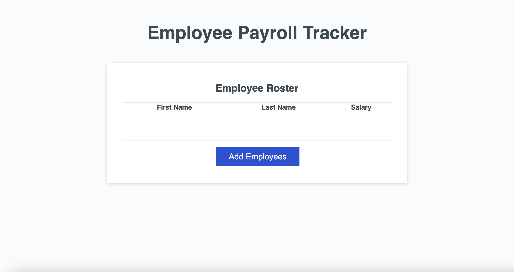

# Module 3 Challenge

## Description

My motivation for this project was to create an efficient way to input employee data, record it, and sort it alphabetically. I built this project to showcase the ease of recording employee data. The website solves the problem of not being able to efficiently record employee data to a central location. I learned about JavaScript, setting variables, and loops. 

## Deployed Site

https://stefanfilm.github.io/Module3Challenge/

## Installation

To install the project, pull the code from https://github.com/stefanfilm/Module3Challenge and open it in a code editor. Open the script.js file in the code editor and view the JavaScript. You could open the index.html file in a browser to see the code function.

## Usage

To use the website, click on the blue Add Employees button. You will see a prompt to add employee info: first name, last name, and salary. Follow the prompts to add another employee and click cancel to complete the list.

    ```md
    
    ```

## Credits

I worked with starter code from UC Berkeley Coding Bootcamp under the instruction of Mark Carlson. 

## License

Refer to the GitHub page. The code belongs to UC Berkeley Coding Bootcamp. 

---

🏆 The previous sections are the bare minimum, and your project will ultimately determine the content of this document. You might also want to consider adding the following sections.

## Badges


